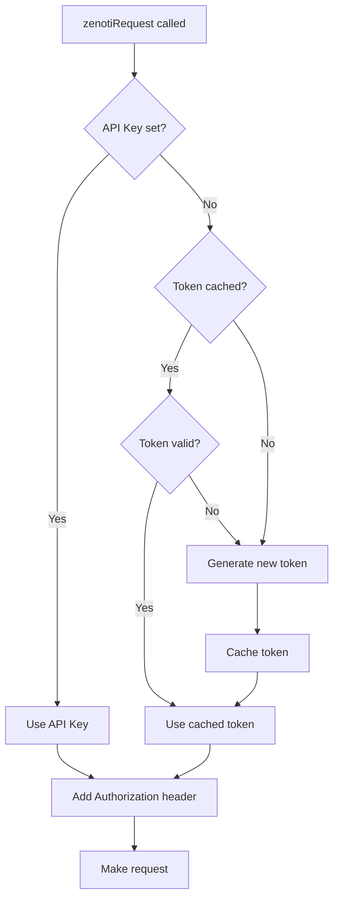

The Zenoti integration supports two authentication methods: long-lived API keys (recommended) and dynamically-generated bearer tokens.

## Authentication Methods

### API Key (Recommended)

Long-lived API key valid for approximately 1 year. Simplest method for server-to-server integration.

<Steps>
  <Step title="Generate API Key">
    In Zenoti Admin, navigate to **Setup > Developer Portal > API Keys** and create a new key.
  </Step>
  <Step title="Set Environment Variable">
    ```bash
    VITE_ZENOTI_API_KEY=your_api_key_here
    ```
  </Step>
  <Step title="Use in Requests">
    The client automatically uses the API key if present — no token generation needed.
  </Step>
</Steps>

### Bearer Token

Dynamically generated from Application ID + Secret Key. Token is valid for 24 hours and cached automatically.

<Steps>
  <Step title="Create Zenoti Application">
    In Zenoti Admin, go to **Setup > Apps** and create a new application. Save the Application ID and Secret Key.
  </Step>
  <Step title="Set Environment Variables">
    ```bash
    VITE_ZENOTI_APP_ID=your_app_id
    VITE_ZENOTI_SECRET_KEY=your_secret_key
    VITE_ZENOTI_ACCOUNT_NAME=your_org_name
    VITE_ZENOTI_BASE_URL=https://api.zenoti.com
    ```
  </Step>
  <Step title="Generate Token">
    Call `getAccessToken()` — the client caches the token and refreshes at 90% of its lifetime.
  </Step>
</Steps>

## Token Generation

### `getAccessToken()`

Generates and caches a bearer access token.

```typescript
export async function getAccessToken(
  config: ZenotiConfig,
): Promise<string>
```

<ParamField path="config" type="ZenotiConfig" required>
  Configuration object containing:
  - `applicationId` — Application ID from Zenoti
  - `secretKey` — Secret key from Zenoti
  - `accountName` — Organization name
  - `baseUrl` — API base URL (e.g., `https://api.zenoti.com`)
</ParamField>

<ResponseField name="return" type="string">
  Bearer access token (cached for 24 hours)
</ResponseField>

**Throws**: `ZenotiAuthError` if required credentials are missing or token request fails

### Example

<CodeGroup>
```typescript Automatic Token Management
import { zenotiRequest } from '@/integrations/zenoti'

// Token is automatically generated and cached
const centers = await zenotiRequest('/v1/centers')
```

```typescript Manual Token Generation
import { getAccessToken, getZenotiConfig } from '@/integrations/zenoti'

try {
  const config = getZenotiConfig()
  const token = await getAccessToken(config)
  
  console.log('Token:', token)
  console.log('Expires:', new Date(Date.now() + 24 * 60 * 60 * 1000))
} catch (error) {
  if (error instanceof ZenotiAuthError) {
    console.error('Auth failed:', error.message)
  }
}
```

```typescript Custom Configuration
import { getAccessToken } from '@/integrations/zenoti'

const token = await getAccessToken({
  baseUrl: 'https://api-eu.zenoti.com',
  applicationId: 'app123',
  secretKey: 'secret456',
  accountName: 'my-spa',
})
```
</CodeGroup>

## Token Request Format

The token endpoint (`POST /v1/tokens`) expects:

```typescript
export interface ZenotiTokenRequest {
  account_name: string
  application_id: string
  secret_key: string
  /** Employee username — required for user-level auth */
  user_name?: string
  /** Employee password — required for user-level auth */
  password?: string
}
```

**Response**:

```typescript
export interface ZenotiTokenResponse {
  access_token: string
  token_type: 'bearer'
  expires_in: number // seconds (default 86,400 = 24 hours)
  issued_at?: string // ISO timestamp
}
```

## Token Caching Strategy

Tokens are cached in memory and automatically refreshed:

```typescript client.ts:38-87
let cachedToken: string | null = null
let tokenExpiresAt = 0

function isTokenValid(): boolean {
  return cachedToken !== null && Date.now() < tokenExpiresAt
}

export async function getAccessToken(
  config: ZenotiConfig,
): Promise<string> {
  // Return cached token if still valid
  if (isTokenValid()) return cachedToken!

  // Generate new token
  const res = await fetch(`${config.baseUrl}/v1/tokens`, {
    method: 'POST',
    headers: { 'Content-Type': 'application/json' },
    body: JSON.stringify({
      account_name: config.accountName,
      application_id: config.applicationId,
      secret_key: config.secretKey,
    }),
  })

  const data = await res.json()
  cachedToken = data.access_token
  
  // Refresh at 90% of lifetime (24h * 900ms = 21.6h)
  tokenExpiresAt = Date.now() + (data.expires_in ?? 86_400) * 900
  
  return cachedToken
}
```

**Key details**:
- Tokens expire after 24 hours (`expires_in: 86400` seconds)
- Client refreshes at 90% of lifetime (21.6 hours)
- Cache is in-memory (cleared on app restart)
- Thread-safe for concurrent requests (single cached token)

## Clearing Token Cache

### `clearAccessToken()`

Manually clear the cached token (e.g., on disconnect or credential change).

```typescript
export function clearAccessToken(): void
```

<CodeGroup>
```typescript On Disconnect
import { clearAccessToken } from '@/integrations/zenoti'

function disconnectZenoti() {
  clearAccessToken()
  // Update connection state
  zenotiStore.setState({ isConnected: false })
}
```

```typescript On Credential Change
import { clearAccessToken, getAccessToken } from '@/integrations/zenoti'

async function updateCredentials(newConfig: ZenotiConfig) {
  // Clear old token
  clearAccessToken()
  
  // Generate new token with updated credentials
  const token = await getAccessToken(newConfig)
  
  console.log('Re-authenticated with new credentials')
}
```
</CodeGroup>

## Configuration Object

### `ZenotiConfig`

```typescript
export interface ZenotiConfig {
  /** Base URL — differs per data center (US, EU, AU) */
  baseUrl: string
  /** API Key — long-lived, valid ~1 year */
  apiKey?: string
  /** Application ID from Zenoti Admin > Setup > Apps */
  applicationId?: string
  /** Secret key generated alongside the Application ID */
  secretKey?: string
  /** Account / organization name in Zenoti */
  accountName?: string
}
```

### `getZenotiConfig()`

Reads configuration from environment variables.

```typescript
export function getZenotiConfig(): ZenotiConfig
```

<ResponseField name="return" type="ZenotiConfig">
  Configuration object with values from `import.meta.env.VITE_ZENOTI_*`
</ResponseField>

**Environment variable mapping**:

```typescript client.ts:26-36
export function getZenotiConfig(): ZenotiConfig {
  return {
    baseUrl: import.meta.env.VITE_ZENOTI_BASE_URL ?? 'https://api.zenoti.com',
    apiKey: import.meta.env.VITE_ZENOTI_API_KEY ?? undefined,
    applicationId: import.meta.env.VITE_ZENOTI_APP_ID ?? undefined,
    secretKey: import.meta.env.VITE_ZENOTI_SECRET_KEY ?? undefined,
    accountName: import.meta.env.VITE_ZENOTI_ACCOUNT_NAME ?? undefined,
  }
}
```

## Regional Data Centers

Zenoti operates separate API endpoints per region:

| Region | Base URL | Environment Variable |
|---|---|---|
| **United States** | `https://api.zenoti.com` | `VITE_ZENOTI_BASE_URL=https://api.zenoti.com` |
| **Europe** | `https://api-eu.zenoti.com` | `VITE_ZENOTI_BASE_URL=https://api-eu.zenoti.com` |
| **Australia** | `https://api-au.zenoti.com` | `VITE_ZENOTI_BASE_URL=https://api-au.zenoti.com` |

<Warning>
  Ensure your `baseUrl` matches your Zenoti account's region. Requests to the wrong data center will fail with authentication errors.
</Warning>

## Authentication Flow

The client uses a two-tier authentication strategy:



**Implementation** (client.ts:125-132):

```typescript
const authHeader: Record<string, string> = {}
if (config.apiKey) {
  // Prefer API key
  authHeader['Authorization'] = config.apiKey
} else {
  // Fallback to bearer token
  const token = await getAccessToken(config)
  authHeader['Authorization'] = `bearer ${token}`
}
```

## Error Handling

### Authentication Errors

```typescript
import { 
  getAccessToken, 
  ZenotiAuthError 
} from '@/integrations/zenoti'

try {
  const token = await getAccessToken(config)
} catch (error) {
  if (error instanceof ZenotiAuthError) {
    // Missing credentials or invalid credentials
    console.error('Auth error:', error.message)
    // Examples:
    // "Missing applicationId, secretKey, or accountName"
    // "Token request failed (401)"
    // "Invalid secret key"
  }
}
```

### Missing Credentials

```typescript client.ts:58-62
if (!config.applicationId || !config.secretKey || !config.accountName) {
  throw new ZenotiAuthError(
    'Missing applicationId, secretKey, or accountName — cannot generate token.',
  )
}
```

### Token Request Failure

```typescript client.ts:76-80
if (!res.ok) {
  const err = await res.json().catch(() => null)
  throw new ZenotiAuthError(
    err?.errors?.[0]?.message ?? `Token request failed (${res.status})`,
  )
}
```

## Security Best Practices

<Warning>
  **Never commit credentials to version control.** Use environment variables or a secrets manager.
</Warning>

1. **Use API Keys for production** — Simpler and more secure than managing application secrets
2. **Rotate keys regularly** — Set calendar reminders to rotate API keys annually
3. **Use environment-specific credentials** — Separate keys for dev, staging, production
4. **Restrict permissions** — Configure Zenoti API keys with minimum required scopes
5. **Monitor usage** — Track API calls in Zenoti's developer portal for anomalies

## Testing Connection

Use the connection test hook to verify credentials:

```typescript
import { useZenotiConnectionTest } from '@/integrations/zenoti'

function SettingsPage() {
  const { refetch, data, error, isLoading } = useZenotiConnectionTest()

  const handleTestConnection = async () => {
    const result = await refetch()
    
    if (result.isSuccess) {
      console.log('Connected to', result.data.centerCount, 'centers')
      console.log('Centers:', result.data.centerNames)
    } else {
      console.error('Connection failed:', result.error)
    }
  }

  return (
    <button onClick={handleTestConnection} disabled={isLoading}>
      {isLoading ? 'Testing...' : 'Test Connection'}
    </button>
  )
}
```

See [Hooks > useZenotiConnectionTest](/api/hooks#usezenoticonnectiontest) for full reference.

## Related

<CardGroup cols={2}>
  <Card title="HTTP Client" icon="network-wired" href="/api/client">
    Request handling and retry logic
  </Card>
  <Card title="Error Handling" icon="triangle-exclamation" href="/api/error-handling">
    ZenotiAuthError and ZenotiApiError reference
  </Card>
</CardGroup>