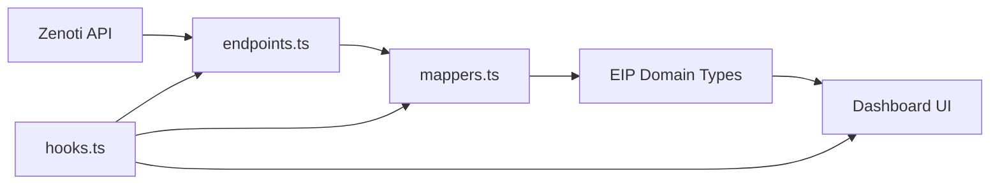

The Zenoti integration provides a complete TypeScript client for syncing spa and wellness center data from Zenoti's REST API into the Etienne Intelligence Platform (EIP).

## Architecture

The integration consists of five core modules:

1. **HTTP Client** (`client.ts`) — Authentication, request handling, retries, and rate-limiting
2. **API Endpoints** (`endpoints.ts`) — Type-safe methods for all Zenoti REST endpoints
3. **Data Mappers** (`mappers.ts`) — Transform Zenoti response types into EIP domain models
4. **React Query Hooks** (`hooks.ts`) — Cached data fetching with automatic fallback to seed data
5. **TypeScript Types** (`types.ts`) — Complete type definitions for all Zenoti API responses

## Key Features

- **Automatic token management** — Bearer tokens are cached and refreshed at 90% of their 24-hour lifetime
- **Exponential backoff** — Automatic retry on 429 rate-limit and 5xx errors with configurable delays
- **Type safety** — Full TypeScript coverage for requests, responses, and domain mappings
- **Demo mode fallback** — Seamlessly switches between live Zenoti data and seed data based on connection state
- **Multi-center support** — Aggregate data across all locations or filter by specific center ID

## Quick Start

<CodeGroup>
```typescript Basic Usage
import { 
  listCenters, 
  listAppointments, 
  mapAppointments 
} from '@/integrations/zenoti'

// Fetch and transform appointments
const raw = await listAppointments({
  centerId: 'abc123',
  startDate: '2026-03-01',
  endDate: '2026-03-31',
})

const appointments = mapAppointments(raw)
```

```typescript React Query Hook
import { useAppointments } from '@/integrations/zenoti'

function Dashboard() {
  const { data, isLoading, error } = useAppointments({
    centerId: 'abc123',
    daysBack: 30,
  })

  if (isLoading) return <Spinner />
  if (error) return <Error message={error.message} />

  return <AppointmentList appointments={data} />
}
```
</CodeGroup>

## Configuration

The integration reads configuration from Vite environment variables:

<ParamField path="VITE_ZENOTI_BASE_URL" type="string" default="https://api.zenoti.com">
  Base URL for the Zenoti API. Varies by data center:
  - **US**: `https://api.zenoti.com`
  - **EU**: `https://api-eu.zenoti.com`
  - **AU**: `https://api-au.zenoti.com`
</ParamField>

<ParamField path="VITE_ZENOTI_API_KEY" type="string">
  Long-lived API key for server-to-server authentication. Valid for ~1 year. **Preferred method** for production use.
</ParamField>

<ParamField path="VITE_ZENOTI_APP_ID" type="string">
  Application ID from Zenoti Admin > Setup > Apps. Required for bearer token authentication.
</ParamField>

<ParamField path="VITE_ZENOTI_SECRET_KEY" type="string">
  Secret key generated alongside the Application ID. Required for bearer token authentication.
</ParamField>

<ParamField path="VITE_ZENOTI_ACCOUNT_NAME" type="string">
  Organization/account name in Zenoti. Required for bearer token authentication.
</ParamField>

## Authentication Methods

Zenoti supports two authentication methods:

### API Key (Recommended)
Long-lived key for server-to-server calls. Set `VITE_ZENOTI_API_KEY` and the client will use it automatically.

### Bearer Token
Generated dynamically from Application ID + Secret Key. The client caches tokens and refreshes them at 90% of their 24-hour lifetime.

## Error Handling

All API methods throw typed errors:

- **`ZenotiApiError`** — HTTP errors (4xx, 5xx) with status code and response body
- **`ZenotiAuthError`** — Authentication failures during token generation

See [Error Handling](/api/error-handling) for complete reference.

## Data Flow



1. **Fetch** — `endpoints.ts` methods call Zenoti REST API via `zenotiRequest()`
2. **Map** — `mappers.ts` functions transform Zenoti types into EIP domain models
3. **Cache** — React Query hooks provide cached, auto-refreshing data with seed fallback
4. **Render** — Dashboard components consume EIP-typed data uniformly

## API Coverage

| Zenoti Resource | Endpoint Method | EIP Type | Mapper |
|---|---|---|---|
| Centers | `listCenters()` | `Location` | `mapCenter()` |
| Services | `listServices()` | `Service` | `mapService()` |
| Guests | `searchGuests()` | `Client` | `mapGuest()` |
| Appointments | `listAppointments()` | `Appointment` | `mapAppointment()` |
| Invoices | `getInvoice()` | — | — |
| Collections | `listCollections()` | `DailyMetrics` | `mapCollection()` |
| Sales Reports | `getSalesReport()` | `DailyMetrics` | `mapSalesReport()` |
| Employees | `listEmployees()` | — | — |

## Next Steps

<CardGroup cols={2}>
  <Card title="HTTP Client" icon="network-wired" href="/api/client">
    Authentication, retries, and rate-limiting
  </Card>
  <Card title="API Endpoints" icon="code" href="/api/endpoints">
    All available endpoint methods
  </Card>
  <Card title="Data Mappers" icon="shuffle" href="/api/data-mappers">
    Zenoti to EIP type transformations
  </Card>
  <Card title="React Hooks" icon="react" href="/api/hooks">
    Query hooks with caching and fallback
  </Card>
</CardGroup>